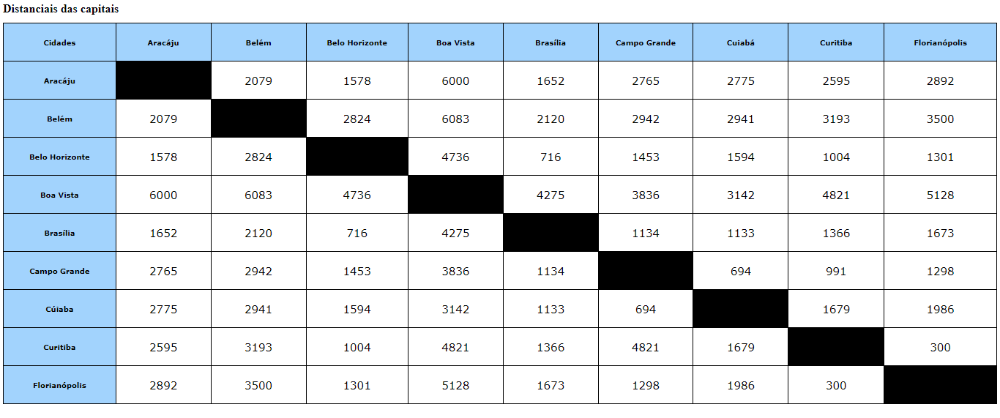

# Índice

* [Descrição](#descri%C3%A7%C3%A3o)
* [Introdução](#introdu%C3%A7%C3%A3o)
* [Funcionalidades](#funcionalidades)
* [Tecnologias utilizadas](#tecnologias-utilizadas)
* [Fontes utilizadas ](#fontes-utilizadas)
* [Autores](#autores)



# Descrição

Projeto aonde deveríamos criar uma tabela que mostrava as distâncias entre as capitais brasileiras com HTML5 e CSS.

# Introdução

No projeto foi indicado que deveriamos fazer esse projeto em um trio, aonde cada membro do grupo fez 9 capitais, totalizando 27 capitais.

# Funcionalidades
Serve como um facilitador que mostra todas as distâncias entre as capitais brasileiras


# Tecnologias utilizadas
## CSS
## HTML5
### Table
```
<td>  
<th>
<tr>
```


## Fontes utilizadas  
 Professor providenciou uma folha que mostrava as distâncias usadas no projeto
## Autores
Ricardo Siena